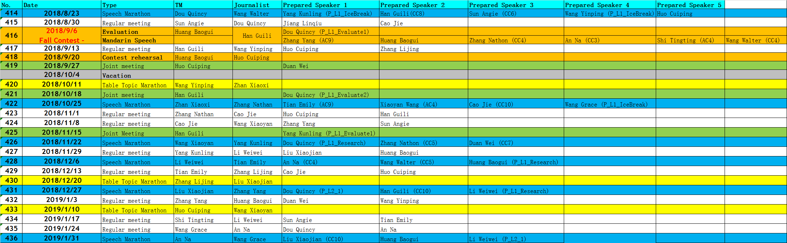

# SSTMC 2018 term2 Speech and TM Role Reservation

| No. | Date | Type | TM | Journalist | Prepared Speaker 1 | Prepared Speaker 2 | Prepared Speaker 3 | Prepared Speaker 4 | Prepared Speaker 5 |  |
| :--- | :--- | :--- | :--- | :--- | :--- | :--- | :--- | :--- | :--- | :--- |
| 414 | 2018/8/23 | Speech Marathon | Dou Quincy | Wang Walter | Yan Kunling | Huan Guili | Sun Angie | Wang Yinping | Huo Cuiping |  |
| 415 | 2018/8/30 | Regular meeting | Sun Angie | Dou Quincy | Jiang Linqiu | Cao Jie |  |  |  |  |
| 416 | 2018/9/6 | Evaluation | Huang Baogui | Han Guili | Dou Quincy \(P\_L1\_Evaluate1\) | Huo Cuiping | Zhan Xiaoxi |  |  |  |
|  | Fall Contest | Mandarin Speech |  |  | Zhang Yang \(AC9\) | Huang Baogui | Zhang Nathon \(CC4\) | An Na \(CC3\) | Shi Tingting \(AC4\) | Wang Walter \(CC4\) |
| 417 | 2018/9/13 | Regular meeting | Han Guili | Wang Yinping | Huo Cuiping | Zhang Lijing |  |  |  |  |
| 418 | "2018/9/20 | Contest rehearsal | Huang Baogui | Huo Cuiping |  |  |  |  |  |  |
| 419 | "2018/9/27 | Joint meeting | Huo Cuiping |  | Duan Wei |  |  |  |  |  |
|  | 2018/10/4 | Vacation |  |  |  |  |  |  |  |  |
| 420 | 2018/10/11 | Table Topic Marathon | Wang Yinping | Zhan Xiaoxi |  |  |  |  |  |  |
| 421 | 2018/10/18 | Joint meeting | Han Guili |  | Dou Quincy \(P\_L1\_Evaluate2\) |  |  |  |  |  |
| 422 | 2018/10/25 | Speech Marathon | Zhan Xiaoxi | Zhang Nathan | Tian Emily \(AC9\) | Xiaoyan Wang \(AC4\) | Cao Jie \(CC10\) | Wang Grace \(P\_L1\_IceBreak\) |  |  |
| 423 | 2018/11/1 | Regular meeting | Zhang Nathan | Cao Jie | Huo Cuiping | Han Guili |  |  |  |  |
| 424 | 2018/11/8 | Regular meeting | Cao Jie | Wang Xiaoyan | Zhang Yang | Sun Angie |  |  |  |  |
| 425 | 2018/11/15 | Joint Meeting | Han Guili |  | Yang Kunling \(P\_L1\_Evaluate1\) |  |  |  |  |  |
| 426 | 2018/11/22 | Speech Marathon | Wang Xiaoyan | Yang Kunling | Dou Quincy \(P\_L1\_Research\) | Zhang Nathon \(CC5\) | Duan Wei \(CC7\) |  |  |  |
| 427 | 2018/11/29 | Regular meeting | Yang Kunling | Li Weiwei | Liu Xiaojian | Huang Baogui |  |  |  |  |
| 428 | 2018/12/6 | Speech Marathon | Li Weiwei | Tian Emily | An Na \(CC4\) | Wang Walter \(CC5\) | Huang Baogui \(P\_L1\_Research\) |  |  |  |
| 429 | 2018/12/13 | Regular meeting | Tian Emily | Zhang Lijing | Cao Jie | Huo Cuiping |  |  |  |  |
| 430 | 2018/12/20 | Table Topic Marathon | Zhang Lijing | Liu Xiaojian |  |  |  |  |  |  |
| 431 | 2018/12/27 | Speech Marathon | Liu Xiaojian | Zhang Yang | Dou Quincy \(P\_L2\_1\) | Han Guili \(CC10\) | Li Weiwei \(P\_L1\_Research\) |  |  |  |
| 432 | 2019/1/3 | Regular meeting | Zhang Yang | Huang Baogui | Duan Wei | Wang Yinping |  |  |  |  |
| 433 | 2019/1/10 | Table Topic Marathon | Huo Cuiping | Wang Xiaoyan |  |  |  |  |  |  |
| 434 | 2019/1/17 | Regular meeting | Shi Tingting | Li Weiwei | Sun Angie | Tian Emily |  |  |  |  |
| 435 | 2019/1/24 | Regular meeting | Wang Grace | An Na | Dou Quincy | An Na |  |  |  |  |
| 436 | 2019/1/31 | Speech Marathon | An Na | Wang Grace | Liu Xiaojian \(CC10\) | Huang Baogui | Li Weiwei \(P\_L2\_1\) |  |  |  |

